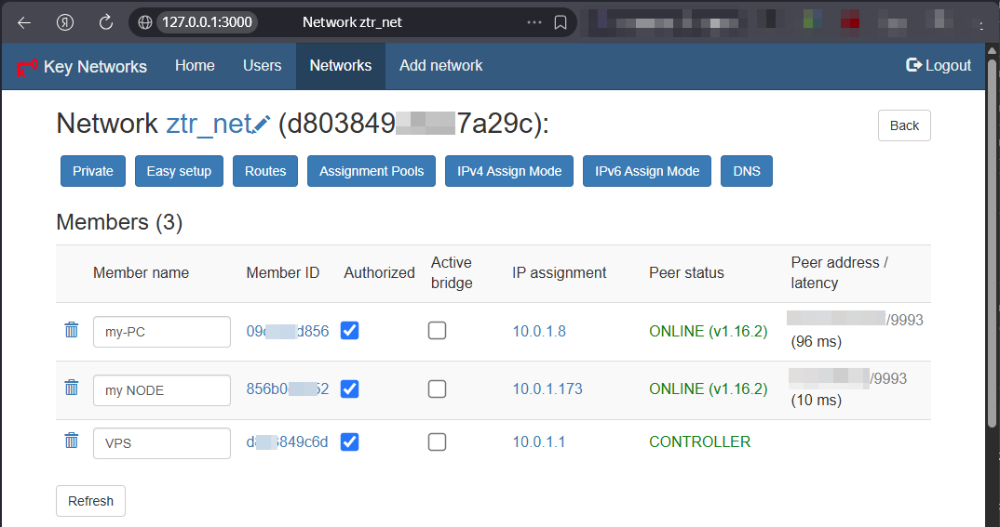
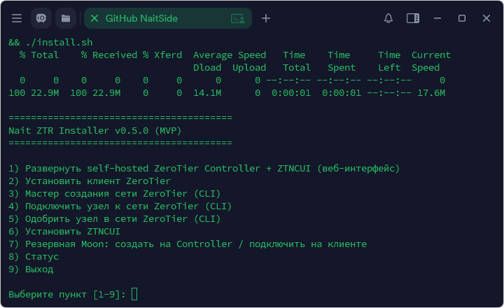
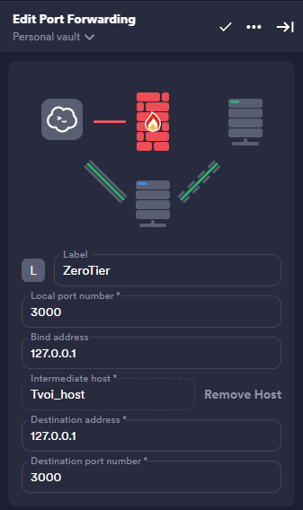
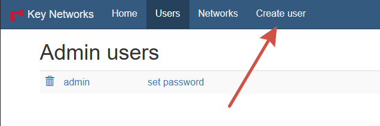

# Nait ZTR Installer

Нужно добавить VPS и домашние устройства в одну локалку? Этот инсталлер поможет развернуть свою ZeroTier-сеть и управлять ей через веб-интерфейс.

## Установка

```bash
cd ~ && curl -L \
-o nait-ztr-installer.tar.gz \
https://api.github.com/repos/NaitSide/Nait_ZTR_Installer/tarball/main \
&& rm -rf Nait_ZTR_Installer \
&& mkdir Nait_ZTR_Installer \
&& tar -xzf nait-ztr-installer.tar.gz -C Nait_ZTR_Installer --strip-components=1 \
&& cd Nait_ZTR_Installer \
&& chmod +x install.sh \
&& ./install.sh
```

> Сеть не создаётся автоматически. 
> После установки создай сеть через пункт 3 в меню
> или через вебморду ZTNCUI

## Что такое ZeroTier?

Это по сути самый дешманский свич TP-Link или D-Link - только виртуальный.
В обычный свич воткнули свои домашние железки с помощю пачкорда, задали ip и маску - готово, железки пингуются, видят дрг друга.
Когда нужно добавить vps сервера в одну локалку без танцев с бубном, тут поможет ZeroTier

## Nait ZTR Installer

Nait ZTR Installer - это интерактивный инсталлер который поможет поднять сеть ZeroTier.

## Как это работает

Один хост будет главный - Это контроллер (оф терминалогия ZeroTier)
там настраивается подсеть
Остальные узлы сети - клиенты

## ZTNCUI

Для простоты управления в инсталлер зашил web-интерфейс ZTNCUI
он как по мне самый адекватны (Я перепробовал все, это больше всего мне понравился)

Сам ZeroTier One, Controller и Moon работают прямо на хосте. Веб-интерфейс запускается отдельно в Docker-контейнере `ztncui_box`. Так сетевой интерфейс ZeroTier остаётся доступен всей системе, а файлы вебморды не смешиваются с системными пакетами и лежат в одном месте: `/opt/naitlab/ztncui_box`.

Если Docker уже установлен, инсталлер использует его. Если Docker отсутствует, перед установкой ZTNCUI в плане будет явно написано, что Docker Engine будет установлен из [официального Docker APT-репозитория](https://docs.docker.com/engine/install/ubuntu/).

Готовый образ `ztncui-aio` здесь специально не используется: в нём вместе с веб-интерфейсом запускается ещё один ZeroTier One. Нам второй экземпляр не нужен — Controller остаётся на хосте, а контейнер содержит только ZTNCUI.



В инсталлере есть интерактивное меню авторизации клиентов в контроллере, если не хотите ставить ZTNCUI, но лучьше поставить, так проще понять что к чему


## Меню




## Доступ к ZTNCUI

Нужно прокинуть SSH тунель (Port Forwarding)
Через Termius это делается так:



и в браузере открой: `http://127.0.0.1:3000`

Дефолтный логин и пароль: `admin` / `password`.

Сразу измени пароль

Там есть пункт - создать юзера - он неочевидный, лучше создать своего и удалить админа.



## Обновление ZTNCUI

Контейнер собирается инсталлером из проверенного DEB-пакета ZTNCUI. Версия пакета, его SHA-256 и версия базового образа закреплены в коде инсталлера, поэтому обновление лучше делать вместе с новой версией Nait ZTR Installer, а не заменять файлы внутри работающего контейнера вручную.

Конфигурация и пользователи ZTNCUI хранятся на хосте:

```bash
/opt/naitlab/ztncui_box/data
```

Перед обновлением сделай backup `/opt/naitlab/ztncui_box` и `/var/lib/zerotier-one/controller.d`. Не меняй файлы в `controller.d` вручную при запущенном `zerotier-one`.

## Проверка перед запуском

```bash
bash -n install.sh
for file in lib/*.sh; do bash -n "$file"; done
./install.sh help
```

## Планеты и Луны — WTF?

ZeroTier работает не как магический виртуальный кабель, который всегда знает, где находятся все устройства. Когда новый узел подключается к сети, перезагружается или меняет домашнюю сеть за NAT, ему сначала нужно найти Controller и других участников.

Для этого у ZeroTier есть официальная инфраструктура root-серверов. Набор этих серверов называется **Planet**. Через Planet узлы обмениваются служебной информацией: где искать Controller и как попытаться связаться друг с другом напрямую, даже если оба сидят за NAT. После знакомства пользовательский трафик между VPS или домашними устройствами обычно идёт напрямую — Planet его не проксирует.

Но представим чебурнет: официальные root-серверы недоступны, а VPS или домашний клиент только что перезагрузился. Он потерял текущее состояние и снова пытается найти Controller. Без запасного маршрута узел может надолго остаться в `REQUESTING_CONFIGURATION`.

На этот случай у ZeroTier есть **Moon** — пользовательский набор дополнительных root-серверов. Это не отдельный Controller и не VPN-прокси. Moon просто даёт клиентам ещё одну известную точку, через которую можно найти твою инфраструктуру. Planet при этом не отключается: Moon используется как дополнительный и резервный путь.

В этом инсталлере Moon создаётся пунктом `7` на Controller. Скрипт сохранит публичный файл `.moon`. Его нужно передать на остальные устройства и на каждом клиенте выбрать пункт `7` → «Из файла .moon» **до** подключения к сети по Network ID. Так клиент заранее знает публичный адрес Moon и сможет попытаться найти Controller, даже если официальная Planet недоступна.

### Как добавить Moon вручную

ZTNCUI помогает создавать сети и одобрять узлы, но не устанавливает Moon на удалённые клиенты. Если не используешь пункт `7` инсталлера, скопируй один и тот же публичный файл `000000<moon-id>.moon` на каждое устройство в папку `moons.d`, затем перезапусти сервис ZeroTier.

| Система | Папка для `.moon`-файла |
| --- | --- |
| Linux | `/var/lib/zerotier-one/moons.d/` |
| Windows | `C:\ProgramData\ZeroTier\One\moons.d\` |

Не переименовывай файл: имя `000000<moon-id>.moon` — часть механики ZeroTier.

> Важно: Moon помогает пережить недоступность официальной инфраструктуры обнаружения, но не делает один VPS бессмертным. В текущем MVP Moon создаётся на том же VPS, что и Controller: если сам этот сервер недоступен, запасного сервера всё ещё нет. Для настоящей отказоустойчивости позже понадобятся отдельные root-серверы и резервные копии Controller.

> Moon — официально документированный механизм ZeroTier, но в актуальной документации он отмечен как legacy-подход для новых развёртываний. Здесь это необязательная экспериментальная функция для тех, кому нужен дополнительный путь обнаружения. Подробнее: [официальная документация ZeroTier о Moon](https://docs.zerotier.com/roots/).

## Используемые проекты

- [ZeroTier One](https://github.com/zerotier/ZeroTierOne)
- [ZTNCUI](https://github.com/key-networks/ztncui)
